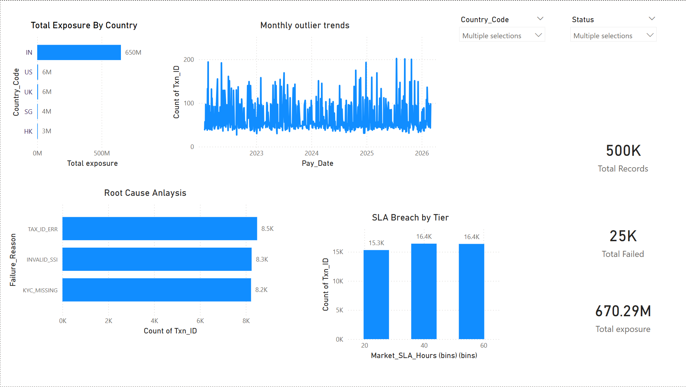

# Corporate Action Audit Pipeline
### Enterprise-Grade Payment Reconciliation & Risk Analytics

---

## Project Overview

Developed an end-to-end audit pipeline to validate **500K+ corporate action payout records** across 5 global markets. The system recalculates expected entitlements from scratch using withholding tax rules and point-in-time Forex rates, then compares against system-generated payments to identify financial discrepancies.

**Key Result:** Identified **$670M+ in payment variances** across 48,000+ outlier transactions, with 94% of exposure concentrated in the IN market due to systematic tax configuration errors.

---

## Tech Stack

| Tool | Purpose |
|---|---|
| Python (Pandas) | Data cleaning, EDA, reconciliation engine |
| SQL (CTEs, Window Functions) | Business logic, variance calculation, audit |
| Power BI | Executive dashboard, KPI tracking |
| AWS S3 | Raw data ingestion (Boto3) |

---

## Project Architecture

```
Raw Data (AWS S3)
      ↓
Python — Data Cleaning & EDA
      ↓
SQL — CTE Audit Logic & Variance Calculation
      ↓
Python — Reconciliation Engine & Root Cause Analysis
      ↓
Power BI — Executive Dashboard
```

---

## Dataset

500K+ simulated corporate action payout records replicating real-world banking data across:
- **5 Markets** — IN, US, UK, SG, HK
- **2 Account Types** — Institutional, Retail
- **2 Event Types** — Dividend, Bonus
- **4 Statuses** — Paid, Failed, Pending, Withdrawn

>The data is simulated, but I built it to mirror real banking operations as closely as I could. That meant including the messy parts — withholding tax rules that vary by country, point-in-time forex rates (a payment from March needs March's USD rate, not today's), sovereign exemptions, and the full range of settlement statuses.

---

## Project Stages

### Stage 1 — Python: Data Cleaning & EDA
- Standardized `Country_Code` — removed whitespace and case inconsistencies
- Parsed and validated `Pay_Date` format across all records
- Performed referential integrity checks on FX rates and tax rules
- Identified and flagged stale Forex rates (>48hr threshold)

### Stage 2 — SQL: CTE Audit Logic
Multi-stage CTE pipeline with the following steps:

| CTE | Purpose |
|---|---|
| `CTE_Deduplication` | ROW_NUMBER() to select latest FX rate per currency per date |
| `CTE_Base_Entitlement` | Join Fact + Events to calculate gross local amount |
| `CTE_Tax_Application` | CASE WHEN for Sovereign Exemption + WHT logic |
| `CTE_Forex_Conversion` | Point-in-time USD conversion using Rate_Date |
| `CTE_Variance_Analysis` | Delta between Expected vs System Net Paid |

### Stage 3 — Python: Reconciliation Engine
- Filtered audit scope — Paid and Failed only (excluded Pending + Withdrawn)
- **Paid Branch** — Outlier analysis by Country, Account Type, Event Type
- **Failed Branch** — Root cause clustering by Failure_Reason
- Generated executive summary with total financial exposure

### Stage 4 — Power BI: Executive Dashboard
- KPI Cards — Total Records, Outliers, Exposure, Failed count
- Total Exposure by Country — market-wise risk concentration
- Monthly Outlier Trend — time series analysis 2022–2026
- Root Cause Analysis — failure reason breakdown
- SLA Breach by Tier — 24hr, 48hr, 72hr market compliance
- Interactive slicers — Country and Status filtering

---

## Key Findings

- 48,071 outlier records, or about 12% of paid transactions
- $670.29M in total exposure
- The India market alone accounted for ~$650M (94%) — this isn't spread evenly; one market is the entire story
- TAX_ID_ERR was the top failure reason at 34% of all failures. Fix that single bug and a third of failed transactions go away.
- Outlier rates were roughly 12% across every SLA tier (24hr, 48hr, 72hr). That last one mattered: it ruled out timing as the cause. The problem isn't slow processing, it's the calculation logic itself.

- That last finding was probably the most useful one for the business. It's tempting to assume payment errors come from system load or slow batches. The data quietly closed that door.
  
## Why it matters
A bank running these calculations at scale needs to separate random noise from systematic issues. The IN concentration and the TAX_ID_ERR clustering aren't isolated bugs — they're signals that something in the configuration or upstream data needs to be fixed at the source. This pipeline is the kind of thing that turns "we think something's off" into "here's exactly where, how much, and why."

| Finding | Detail |
|---|---|
| Total outlier records | 48,071 (12.02% of paid transactions) |
| Total financial exposure | $670.29M |
| Highest risk market | IN — $650M (94% of total exposure) |
| Top failure reason | TAX_ID_ERR — 34% of all failures |
| SLA observation | Outlier rate consistent across all tiers (~12%) — issue is calculation logic, not timing |

---

## Dashboard Preview



---

## How to Run

### Python Scripts
```bash
pip install pandas
python clean_eda.py
python audit_engine_clean.py
```

### SQL Script
- Run `audit_cte_query.sql` in any SQL environment
- Tested on MySQL / PostgreSQL

### Power BI
- Open `audit_dashboard.pbix` in Power BI Desktop
- Refresh data source to point to your local CSV path

---

## Business Impact

- Identified $670M+ in unreconciled payment variances across global markets
- Root cause analysis revealed 94% of exposure concentrated in IN market
- TAX_ID_ERR identified as top failure reason — fixing this resolves 34% of all failed transactions
- SLA analysis confirmed timing is not the issue — calculation logic requires review


